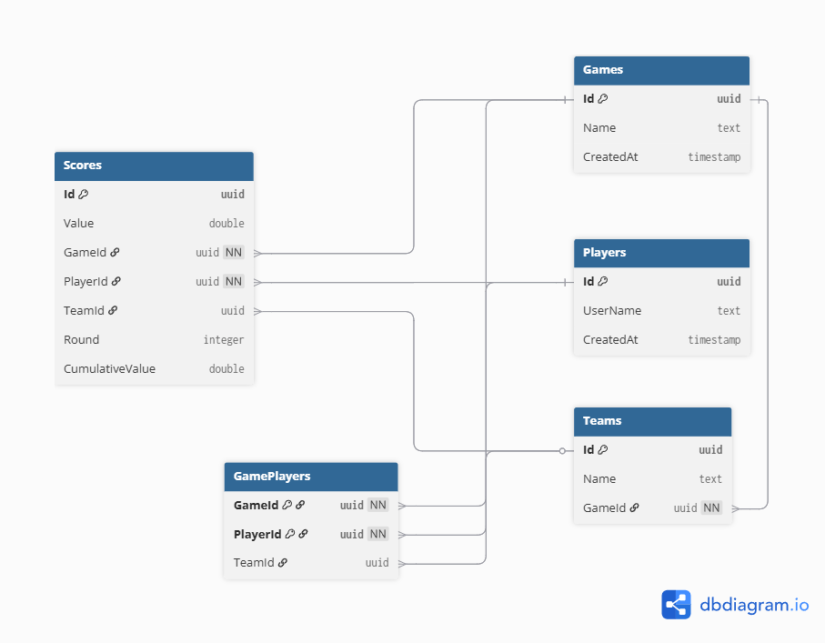

# Databasdesign
- **Game** är navet.
- **Scores**, **Teams** och **GamePlayers** pekar alla på ett **GameId**.
- **Spelare** kopplas till spel via **GamePlayers** (join-tabell), och **poäng** registreras per **spelare** (och **valfritt lag**) i **Scores**.

Se [databasdiagram](poangapp_db_design.png) för en överblick över tabellerna och deras kopplingar.

### Kopplingspunkter
Givet ett Game.Id:
1. **Spelare i spelet:**

*GamePlayers WHERE GameId = ?
→ JOIN Players ON PlayerId
→ JOIN Teams ON TeamId (om lagbaserat)*

2. **Poäng i spelet:**

*Scores WHERE GameId = ?
→ JOIN Players ON PlayerId (vems poäng)
→ JOIN Teams ON TeamId (vilket lags poäng, valfritt)*

3. **Lag i spelet:**

*Teams WHERE GameId = ?
→ JOIN GamePlayers ON TeamId (vilka spelare är i laget)*

**Scores** är kopplingspunkten för allt **poängrelaterat**.
**GamePlayers** är kopplingspunkten för **spelardeltagande**.
**Teams** ägs av **Game** och refereras av både **GamePlayers** och **Scores**.

